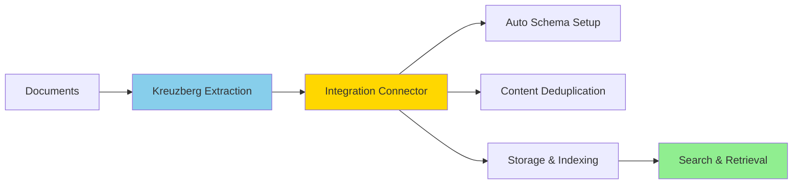

# Integrations

Kreuzberg integrates with external databases and services to store, index, and search extracted documents.

Each integration connects Kreuzberg's extraction output to a target system — handling schema setup, content deduplication, and indexing automatically.

---

## Available Integrations

| Integration | Target | Package | Search Capabilities | Status |
|---|---|---|---|---|
| [SurrealDB](surrealdb.md) | [SurrealDB](https://surrealdb.com/) | [`kreuzberg-surrealdb`](https://pypi.org/project/kreuzberg-surrealdb/) | BM25, Vector (HNSW), Hybrid (RRF¹) | :white_check_mark: Stable |

¹ RRF = Reciprocal Rank Fusion — a method for combining results from multiple search strategies into a single ranked list.

---

## How Integrations Work

All integrations follow a consistent four-step pipeline:

1. **Extract** — Kreuzberg parses documents, runs OCR where needed, and produces clean text output.
2. **Connect** — The integration connector receives that output and manages the target database connection.
3. **Store** — Content is deduplicated via SHA-256 hashing, optionally chunked and embedded, then written to the database using an auto-generated schema.
4. **Search** — The target database's native search capabilities — full-text, vector, or hybrid — are available immediately after ingestion.

## Common Features

All integrations share these capabilities:

- **Automated schema management** — tables, indexes, and analyzers are created automatically via `setup_schema()`, no manual setup required.
- **Content deduplication** — SHA-256 hashing prevents duplicate storage across repeated ingestion runs.
- **Flexible ingestion** — ingest single files, multiple files, directories with glob patterns, or raw bytes.
- **Configurable extraction** — pass Kreuzberg's `ExtractionConfig` to control OCR behavior, output format, and quality processing.
- **Batch processing** — tune `insert_batch_size` to balance throughput and memory use during bulk ingestion.

!!! tip "Building a New Integration?"
    Follow the pattern established by the [SurrealDB integration](https://github.com/kreuzberg-dev/kreuzberg-surrealdb), which serves as the reference implementation.